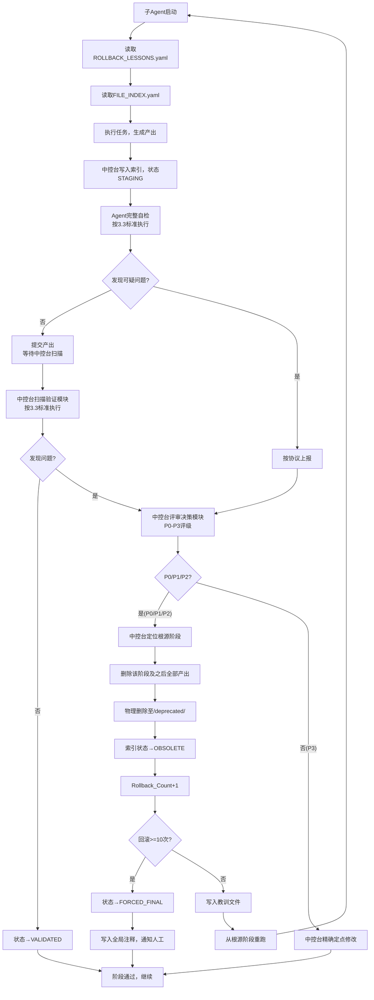

# 数学建模竞赛自动化论文撰写系统——流程架构设计书

> **版本**：v3.18 | **框架**：DeepSeek Harness | **输出**：Markdown
> **核心理念**：索引导航 + 根源定位 + 阶段级删除 + 双重质疑 + 教训持久化 + P3精确定点修改


## 一、概述

本设计书定义**大学生数学建模竞赛论文撰写**自动化流程架构。

**适用范围**：CUMCM、MCM/ICM及同类竞赛。

**设计原则**：
1. **索引导航**：索引文件记录所有产出物的位置、摘要与状态
2. **伪线性推进**：回滚通过"物理删除下游 + 重新执行"实现，无复杂版本分支
3. **集中评级**：问题统一由中控台评级，Agent不自行判断
4. **双重质疑**：Agent自检与中控台扫描执行相同标准，形成双重验证
5. **阶段级回滚**：定位问题根源阶段，删除该阶段及之后所有阶段的全部产出
6. **教训持久化**：每次触发回滚时写入教训文件，所有Agent执行前必须读取
7. **防崩溃优先**：回滚上限10次，超限强制锁定，确保必然产出


## 二、系统架构

```
┌─────────────────────────────────────────────────────────────────────────┐
│                        中控台（Supervisor）                             │
│  ┌──────────────────────────┐  ┌──────────────────────────────────┐   │
│  │      扫描验证模块         │  │         评审决策模块              │   │
│  │  对流水线产出进行扫描      │  │  阅读汇报文件、评级、定位、修改/删除 │   │
│  └──────────────────────────┘  └──────────────────────────────────┘   │
│  索引维护 | 问题评级(P0-P3) | 根源定位 | 阶段级删除 | 教训写入        │
│  版本冻结 | 回滚计数 | DAG验证(必须) | 事务日志 | 异常重试            │
└─────────────────────────────────────────────────────────────────────────┘
                                    ▲
                                    │ 汇报问题（仅事实，不评级）
                                    ▼
┌─────────────────────────────────────────────────────────────────────────┐
│                   论文生成流水线（执行层）                               │
│  阶段零(初始化) → 阶段一(EDA) → 阶段二(建模) → 阶段三(撰写) → 阶段四(排版) │
│              每完成一子阶段即执行完整自检并上报                          │
└─────────────────────────────────────────────────────────────────────────┘
```

**中控台两个职能模块**：

| 模块             | 触发时机                                              | 职责                               |
| :--------------- | :---------------------------------------------------- | :--------------------------------- |
| **扫描验证模块** | 流水线Agent报告完成且无自检问题                       | 对产出物进行扫描验证，发现潜在问题 |
| **评审决策模块** | 收到Agent上报的问题（自检发现）或扫描验证模块发现问题 | 评级、定位根源、执行修改或回滚     |

**职责边界**：

| 层级            | 发现问题          | 评级                  | 定位根源              | 执行删除 | 维护索引 | 写入教训 |
| :-------------- | :---------------- | :-------------------- | :-------------------- | :------- | :------- | :------- |
| **流水线Agent** | ✅                 | ❌                     | ❌                     | ❌        | 只读     | 只读     |
| **中控台**      | ✅（扫描验证模块） | ✅唯一（评审决策模块） | ✅唯一（评审决策模块） | ❌        | ✅唯一    | ✅唯一    |
| **代码逻辑**    | ❌                 | ❌                     | ❌                     | ✅唯一    | ❌        | ❌        |

> **Harness 落地说明**：宿主代码逻辑没有文件删除/改名接口，物理删除由评审决策模块子智能体使用文件工具执行（将文件移入 `/deprecated/`）；回滚计数器维护、重跑调度、强制锁定判定由代码逻辑（宿主）执行。


## 三、核心机制

### 3.1 索引文件（FILE_INDEX.yaml）

**设计目的**：记录所有产出物的位置、摘要、状态与依赖关系，从物理层面杜绝上下文污染。

**索引文件结构示例**：
```yaml
# ====== 文件索引 File Index ======
# 最后更新: 2026-08-22 18:30:00
# 当前流水线阶段: 阶段二-子阶段3（模型求解进行中）
# 总回滚次数: 1

INDEX:
  - FILE_ID: "PROJ-001"
    FILE_NAME: "Project_Config.yaml"
    FILE_PATH: "/config/"
    FILE_TYPE: "配置文件"
    CREATED_BY: "阶段零-子阶段1"
    STATUS: "VALIDATED"
    VALIDATED_AT: "2026-08-22 10:00:00"
    SUMMARY: "赛题编号、数据路径、输出格式等全局配置"
    DEPENDENCIES: []
    
  - FILE_ID: "DATA-001"
    FILE_NAME: "raw_data_v1.csv"
    FILE_PATH: "/raw_data/"
    FILE_TYPE: "原始数据"
    CREATED_BY: "阶段零-子阶段2"
    STATUS: "VALIDATED"
    VALIDATED_AT: "2026-08-22 10:15:00"
    SUMMARY: "官方原始数据，1532行×8列，无缺失"
    DEPENDENCIES: []
    
  - FILE_ID: "EDA-001"
    FILE_NAME: "EDA_Report.md"
    FILE_PATH: "/stage_01_outputs/"
    FILE_TYPE: "分析报告"
    CREATED_BY: "阶段一-子阶段3"
    STATUS: "VALIDATED"
    VALIDATED_AT: "2026-08-22 11:30:00"
    SUMMARY: "特征X1与Y正相关(r=0.78)，X3负相关(r=-0.52)"
    DEPENDENCIES: ["DATA-001"]
    
  - FILE_ID: "MODEL-001"
    FILE_NAME: "model_assumptions.md"
    FILE_PATH: "/stage_02_outputs/"
    FILE_TYPE: "建模文档"
    CREATED_BY: "阶段二-子阶段1"
    STATUS: "STAGING"
    VALIDATED_AT: null
    SUMMARY: "使用随机森林模型，特征筛选采用后向消除法"
    DEPENDENCIES: ["EDA-001"]
    
  - FILE_ID: "MODEL-002"
    FILE_NAME: "model_solution.py"
    FILE_PATH: "/stage_02_outputs/code/"
    FILE_TYPE: "求解代码"
    CREATED_BY: "阶段二-子阶段3"
    STATUS: "OBSOLETE"
    VALIDATED_AT: "2026-08-22 14:00:00"
    OBSOLETE_AT: "2026-08-22 16:30:00"
    OBSOLETE_REASON: "回滚至阶段二-子阶段1，因线性假设被证伪"
    SUMMARY: "线性回归求解代码（已废弃）"
    DEPENDENCIES: ["EDA-001"]
```

**文件状态**：

| 状态             | 含义                         | 可被下游引用？        | 触发条件          |
| :--------------- | :--------------------------- | :-------------------- | :---------------- |
| **STAGING**      | 新生成，未验证               | ❌（同阶段内特例除外） | Agent产出后默认   |
| **VALIDATED**    | 已验证，无问题               | ✅                     | 扫描通过          |
| **OBSOLETE**     | 回滚废弃，已移至/deprecated/ | ❌                     | 回滚执行后        |
| **FORCED_FINAL** | 回滚超限强制锁定             | ✅（须知晓瑕疵）       | 同一阶段回滚≥10次 |

**Agent使用流程**：
```
1. 读取 ROLLBACK_LESSONS.yaml → 掌握历史教训
2. 读取 FILE_INDEX.yaml → 定位上游文件
3. 验证目标文件状态（VALIDATED / FORCED_FINAL）
   （同阶段内可读STAGING，跨阶段禁止，见R-013b）
4. 读取文件内容，执行任务，生成产出
5. 执行完整自检（按3.3标准执行）
6. 向中控台报告完成（通过 `_report.yaml` 文件 + 信号通知，详见3.10）
7. 中控台更新索引（状态默认为STAGING）
```

**关键规则**：Agent只读索引和教训文件，绝不自行修改。

### 3.2 问题上报协议

Agent上报格式（仅客观事实）：
```yaml
问题描述: "模型求解结果为负值，实际应为正值"
发生位置: "阶段二 > 子阶段3（模型求解）"
涉及文件ID: ["MODEL-001"]
影响范围: "可能影响后续灵敏度分析"
# 禁止出现严重程度、紧急程度等主观评级
```

上报通过 `_report.yaml` 文件方式传递（详见3.10.2），该文件位于当前阶段产出目录中，中控台读取后移入 `/deprecated/`。

### 3.3 质疑标准（统一）

Agent自检与中控台扫描执行**相同标准**，形成双重验证：

| 维度       | 检查内容                                                     |
| :--------- | :----------------------------------------------------------- |
| 逻辑自洽性 | 结论是否支持上一阶段假设？段落逻辑是否顺畅？                 |
| 模型合理性 | 是否符合常识？有无更优替代方案？                             |
| 数据敏感性 | 结论对数据变化是否过于敏感？                                 |
| 视觉合理性 | 图表是否清晰表达数据特征或模型结构？图表类型是否合理？可视化结果是否与数值结论一致？ |
| 规范符合性 | LaTeX语法、Markdown格式、路径是否存在、引用编号是否连续？    |
| 教训对照   | 是否重复历史教训文件中的错误？                               |

**执行方式**：

Agent自检与中控台阶段性质疑均按上述完整标准执行。其中：

| 维度       | 执行方法                                                     |
| :--------- | :----------------------------------------------------------- |
| 逻辑自洽性 | 对比当前产出与上一阶段产出、检查段落间逻辑传导、验证编号体系一致性 |
| 模型合理性 | 基于常识推理、对比已知基准、评估模型复杂度与问题匹配度       |
| 数据敏感性 | 分析结论对输入波动的敏感程度、评估关键假设放宽后的稳定性     |
| 视觉合理性 | 调用视觉模块审阅图表内容（详见下方说明）                     |
| 规范符合性 | 格式检查、路径校验、引用编号核查                             |
| 教训对照   | 逐条比对教训文件中的`AVOIDANCE_GUIDANCE`，确认已规避         |

- **各阶段Agent自检均须覆盖全部维度，四中列出的仅为该阶段的重点检查项**
- **视觉模块调用**：Agent在执行自检、中控台在执行阶段性质疑扫描时，针对涉及图表的产出物（阶段二生成的数据对比图、模型结构示意图、流程图等），**必须调用视觉模块（Vision Module）对图表内容进行审阅**。

**视觉检查分为两个阶段执行**：

**第一阶段——视觉模块详实描述**：
视觉模块必须对图表内容进行**清晰、完整、有条理的自然语言描述**，而非仅给出判断结论。描述应包含但不限于以下维度：

- **数据分布**：散点的分布范围（如"X轴范围0~100，Y轴范围0~50"）、分布密度（如"散点主要集中在X=20~60区域，Y=10~35区域"）、聚集形态（如"呈带状聚集，无明显离群点"）

- **拟合/对比关系**：若图表包含拟合曲线或对比线，需描述散点与曲线的吻合程度（如"X=30~50区间，散点紧密贴合曲线；X=60~80区间，散点整体偏离曲线下方约5个单位"）、偏差方向与幅度

- **趋势方向与关键转折点**：
  - **单调性与波动**：数据总体是持续上升、持续下降，还是剧烈震荡无明显趋势？
  - **拐点与极值**：曲线的"波峰/波谷"出现在哪些X值附近？斜率突然变陡或变平的位置在哪里（如"X=45附近出现急速下滑"）？这些通常是现象突变的关键节点，比全局拟合更重要
  - **趋势分段**：若趋势在不同区间表现不同，需分段描述（如"X<30时缓慢上升，X=30~60时急速上升，X>60后趋于平缓"）

- **数据密度与重叠遮蔽**：
  - **重叠程度**：是否存在大量散点完全重叠？若存在，描述重叠区域的位置和大致重叠层数（如"X=20~30，Y=15~20区间内散点密集重叠，肉眼呈深色团块"）
  - **边际分布**：数据是否紧贴坐标轴边缘？若紧贴边界，需说明是数据真实分布如此，还是暗示存在截断或饱和效应
  - 建议：若重叠严重，可建议引入抖动（Jitter）或透明度（Alpha）辅助观察

- **分组间的分离度与交叉重叠**（若图表包含多组数据）：
  - **组间区分度**：多组散点/曲线是完全隔离（界限清晰），还是大面积交织（难以区分）？
  - **相对位置**：在特定X区间内，哪一组始终位于上方（占优）？这种优势是否在整个X范围内恒定？

- **坐标轴与标注**：坐标轴刻度是否合理、单位是否标注、图例是否完整

- **视觉特征**：颜色使用是否清晰、是否有误导性截断

- **背景信息与数据来源偏见**（元数据审视）：
  - 图表呈现的关系是否符合常识？（如"年龄与死亡风险负相关"是否可能未校正混杂因素？）

- **图表叙事与行动建议**：
  - **异常值的归因**：离群点是数据录入错误、特殊事件，还是新趋势的开端？
  - **结论的稳健性**：若去掉少数极端点，拟合曲线会大变吗？暗示结论是否脆弱？

视觉模块的输出为自然语言文本，示例如下：
```
图表类型：散点图与拟合曲线叠加。
数据分布：X轴范围0~100，Y轴范围0~50。散点主要集中在X=20~60、Y=10~35区域内，呈带状聚集。
拟合曲线为二次多项式。在X=30~50区间，散点紧密贴合曲线；在X=60~80区间，散点整体偏离曲线下方约5个单位；X>80后偏差方向转为向上。

趋势方向与关键转折点：
- 总体趋势：先升后降，呈倒U型
- 拐点：峰值出现在X=45附近（Y≈38）
- 分段特征：X<30时缓慢上升；X=30~60时快速上升至峰值后迅速下降；X>60后下降趋缓
- 斜率突变：X=42~48区间斜率由正转负，变化剧烈

数据密度与重叠遮蔽：
- X=20~30，Y=15~20区间存在明显重叠，约3~4层散点堆叠
- 建议引入透明度（alpha=0.5）或抖动以改善可视性
- 数据未紧贴坐标轴边缘，无截断迹象

分组对比（实验组 vs 对照组）：
- X<40：两组交织，无明显差异
- X>40：实验组持续位于对照组上方，优势在X=50~70区间最为明显

坐标轴：X轴标注为"时间（小时）"，Y轴标注为"温度（℃）"，图例完整，Y轴从0开始，无截断。
背景审视：关系符合物理常识（温度随时间先升后降）。
异常值：X=85处存在1个离群点（Y≈48），显著高于拟合曲线，可能为特殊事件。
稳健性：若去掉该异常值，拟合曲线在X>80区间变化较大，结论在该区间不够稳健。

结论：整体拟合程度中等，存在系统性偏差区间。
```

**第二阶段——审阅与质疑**：
收到视觉描述后，对其进行系统性质疑，检查：

- **描述合理性**：描述内容是否自洽？（如"散点高度聚集"与"R²=0.92"是否矛盾？）

- **上下文一致性**：描述中的数值范围、趋势是否与索引文件中的数值结果一致？（如索引中记录"峰值出现在X=45"，但视觉描述中峰值出现在X=70，需标记为不一致）

- **趋势审阅**：
  - 拐点位置是否合理（是否符合数据分布的自然转折）？
  - 分段趋势描述是否与数据形态匹配？
  - 斜率突变处是否有足够的数据点支撑？

- **密度与遮蔽审阅**：
  - 重叠区域的描述是否与实际数据量匹配？
  - 是否存在边际效应（数据紧贴边界）未识别？
  - 是否需要建议引入抖动/透明度？

- **分组审阅**（若有多组数据）：
  - 组间区分度判断是否准确？
  - 优势组的判定是否有足够的X区间支撑？

- **背景偏见审阅**：
  - 图表结论是否可能存在未控制的混杂因素？
  - 关系是否符合领域常识？若不符合，是否已说明原因？

- **叙事与行动审阅**：
  - 异常值的归因是否合理？
  - 结论稳健性评估是否充分？

- **误导性识别**：坐标轴截断、颜色使用等是否存在误导性表达

- **结论验证**：图表结论是否与其描述逻辑一致？（如描述说"散点与曲线偏差较大"，但图表结论却写"拟合良好"）

**执行者分工**：
- Agent自检时：由Agent自身执行第二阶段审阅，发现问题后按3.10上报
- 中控台扫描时：由中控台扫描验证模块执行第二阶段审阅，形成双重验证

若第二阶段发现任何问题，将其作为"视觉审阅发现的问题"纳入整体质疑结果，按3.4评级标准进行评级处置。

### 3.4 风险评级标准

| 等级             | 定义                             | 处置策略                         |
| :--------------- | :------------------------------- | :------------------------------- |
| **P0（阻断级）** | 后续流程无法继续，或结论完全错误 | 回滚，计数器+1，位置由中控台裁定 |
| **P1（严重级）** | 严重影响论文质量                 | 回滚，计数器+1，位置由中控台裁定 |
| **P2（一般级）** | 局部质量问题，不伤及核心逻辑     | 回滚，计数器+1，位置由中控台裁定 |
| **P3（轻微级）** | 润色层面，不影响学术实质         | 精确定点修改，流水线继续         |

### 3.5 P3问题处理闭环

P3评级后，中控台执行**精确定点修改**，而非回滚或记录问题。

**核心原则**：
- P3问题不影响流水线推进
- 中控台直接对问题文件进行修改，不记录到索引
- 仅做限定范围内的精确定点修改，不做多余改动

**精确定点修改判定标准**：
- **精确定点修改**：修改范围≤3行代码/≤1个句子/≤3个参数
- **超出精确定点修改**：修改范围>3行代码/需要重构整个段落/需要重新设计图表结构/修改涉及多个不连续位置
- 中控台在判定时，若难以确定是否超边界，默认升级为P2（保守策略）

**中控台定位与修改流程**：

1. **阅读问题报告**，解析问题涉及的文件ID和具体位置
2. **定位到问题所在行或段落**，明确修改边界
3. **执行精确定点修改**：
   - 修改原则：只改问题直接涉及的内容，不重写整段、不重构结构、不扩展范围
   - 修改示例：
     - 措辞不够学术 → 仅替换对应词汇
     - 标点符号错误 → 仅修正标点
     - 图表美观度问题 → 仅调整配色/尺寸参数，不重建图表
     - LaTeX语法错误 → 仅修正该处语法
4. **修改完成后流水线继续推进**，不触发任何回滚操作

**约束**：
- 若问题修改范围超出"精确定点修改"边界（如需要重构整个段落、重新设计图表结构），则将该问题升级为P2处理（触发回滚）
- P3修改不涉及索引状态变更
- P3精确定点修改后，文件状态按以下规则处理：
  - 若修改前文件状态为 `STAGING`：中控台应**将该文件状态直接升级为 `VALIDATED`**（因为修改不涉及核心逻辑，且已通过中控台审阅），无需重新扫描
  - 若修改前文件状态为 `VALIDATED`：修改后其状态保持不变
  - P3修改不影响下游文件。下游Agent通过索引获取文件路径，读取的是修改后的最新文件，无需特殊处理
- 若中控台判定P3问题**无法自动进行精确定点修改**（如问题描述模糊、无法定位具体位置、修改可能引入新问题），中控台应跳过自动修改，直接标记为"待人工P3修改"，并继续推进流水线（不阻断、不回滚）

### 3.6 回滚与删除机制

**核心规则**：P0/P1/P2问题触发回滚，中控台向前定位根源阶段，删除该阶段及之后所有阶段的全部产出，从该阶段重跑。

**中控台定位流程**：
1. 阅读问题报告和索引
2. 判断问题涉及的文件及其依赖链
3. 确定根源最早所在的阶段

**输出格式**：
```yaml
根源阶段: "阶段一"
定位理由: "建模结果异常，追溯发现EDA阶段错误剔除了关键特征"
涉及文件: ["DATA-001", "EDA-001", "MODEL-001"]
```

**删除范围**：`根源阶段的所有产出物 ∪ 根源阶段之后所有阶段的所有产出物`

**示例**：问题根源在阶段二子阶段2 → 删除阶段二（全部）+ 阶段三（全部），从阶段二重跑。

**操作顺序**：
1. 定位根源阶段
2. 物理移动文件至 `/deprecated/`
3. 索引状态更新为 `OBSOLETE`
4. 回滚计数器 +1
5. 若回滚次数 < 10次，写入教训文件，从根源阶段重跑
6. 若回滚次数 ≥ 10次，强制锁定，状态改为 `FORCED_FINAL`，通知人工

**物理删除规则**：

| 规则   | 内容                                                |
| :----- | :-------------------------------------------------- |
| R-001  | 中控台定位根源阶段                                  |
| R-001b | 回滚次数<10次时，中控台写入教训文件（重跑前）       |
| R-002  | 删除执行模块删除根源阶段及之后所有阶段的全部产出    |
| R-003  | 物理移动文件至 `/deprecated/`                       |
| R-004  | 索引状态更新为 `OBSOLETE`                           |
| R-005  | 重跑后新产出物写入原路径（旧产出已物理移入 `/deprecated/`，原路径为空），状态为 `STAGING`；需要版本化路径（如 v2/）时由中控台注入版本号 |

**操作顺序保证**：定位根源 → 物理移动 → 更新索引 → 回滚计数 → 若<10次则写入教训并重跑；若≥10次则强制锁定。任一步骤失败则回退，保证一致性。

**依赖链更新**：回滚时，除将被删除文件的 `STATUS` 改为 `OBSOLETE` 外，中控台还应**递归检查所有未被删除的文件**，若其 `DEPENDENCIES` 字段包含已废弃的 `FILE_ID`，则将该依赖标记为 `OBSOLETE_DEPENDENCY`（保留记录，但提示Agent该依赖已失效）。

### 3.7 防崩溃：回滚次数上限

- 同一阶段累计回滚 **≥10次** 时强制冻结
- 冻结后：状态改为 `FORCED_FINAL`，写入全局注释区，问题降级为P3处理方式（精确定点修改），通知人工
- 计数器递增对象：**被回滚到的阶段**（重跑起点），而非发现问题的阶段
- 锁定后该阶段**不再回滚、不再计数**：后续针对该阶段的回滚请求一律降级为 P3 处理，流水线继续推进

### 3.8 执行失败处理

非质量问题的执行失败（超时/工具调用失败/格式异常/崩溃）：
- 重试上限3次，指数退避（5s/10s/20s）
- 重试语义：初始执行 1 次 + 重试 3 次（共 4 次尝试）；流水线执行Agent 与中控台扫描验证/评审决策模块同样适用
- 3次全失败后暂停流水线，人工介入
- 不计入质量回滚计数器
- 失败日志写入 `/transactions.log`
- 上报缺失兜底：执行Agent 未产出 `_report.yaml`（且回复无状态行）时，按 SUCCESS 处理并交扫描验证模块复核

### 3.9 教训文件（ROLLBACK_LESSONS.yaml）

**设计目的**：将回滚教训持久化，实现经验跨阶段传递和累积。

**结构**：
```yaml
LESSONS:
  - LESSON_ID: "LSN-001"
    TIMESTAMP: "2026-08-22 14:30:00"
    SOURCE_AGENT: "建模求解Agent"
    PROBLEM_SUMMARY: "模型求解结果为负值"
    ROOT_CAUSE: "数据清洗时单位换算乘错系数"
    ROOT_STAGE: "阶段一-子阶段1"
    AFFECTED_STAGES: ["阶段一", "阶段二", "阶段三"]
    AVOIDANCE_GUIDANCE: "单位换算需双重校验"
    STATUS: "ACTIVE"  # ACTIVE / RESOLVED
```

**写入与读取**：
- 写入：中控台（每次P0/P1/P2回滚且回滚次数<10次时，删除后、重跑前写入）
- 读取：所有流水线Agent（启动时**必须**读取）
- 修改：人工可选（编辑教训状态或内容）

### 3.10 Agent间通信机制

#### 3.10.1 流水线Agent上报流程

Agent完成任务后，在产出目录下写入 `_report.yaml` 文件，内容按3.2格式。无论是否有问题都必须写入，`status` 字段区分 `SUCCESS` / `HAS_ISSUES` / `NEEDS_REVIEW`：

```yaml
# ====== Agent上报报告 ======
agent_id: "阶段二-子阶段2.5"
timestamp: "2026-08-28 14:30:00"
status: "HAS_ISSUES"  # SUCCESS / HAS_ISSUES / NEEDS_REVIEW
issues:
  - problem: "模型求解结果为负值，实际应为正值"
    location: "阶段二 > 子阶段3（模型求解）"
    involved_files: ["MODEL-001"]
    impact: "可能影响后续灵敏度分析"
    suggestion: "建议检查模型假设中关于XX的约束条件"
```

（无问题时 `issues` 为空数组）

#### 3.10.2 中控台处理流程

中控台收到信号后：
1. 读取指定路径的 `_report.yaml` 文件
2. 若 `status` 为 `SUCCESS`：启动**扫描验证模块**，按3.3标准扫描产出物
3. 若 `status` 为 `HAS_ISSUES` 或 `NEEDS_REVIEW`：启动**评审决策模块**，按3.4标准评级并执行相应处置
4. 读取并处理后，将报告文件移入 `/deprecated/`
5. **防陈旧**：读取时校验报告内 `agent_id` 与当前子阶段一致，不一致视为上报缺失（按 SUCCESS 交扫描复核）；中控台处理完成后必须将报告移入 `/deprecated/`，保证下一子阶段写入全新报告


## 四、流水线阶段

```
阶段零(初始化) → 阶段一(EDA) → 阶段二(建模) → 阶段三(撰写) → 阶段四(排版)
```

**各阶段核心任务与质疑要点**：

| 阶段   | 子阶段                                                       | 核心产出                                                     | Agent自检重点（按3.3完整标准，此处列出阶段重点）             |
| :----- | :----------------------------------------------------------- | :----------------------------------------------------------- | :----------------------------------------------------------- |
| **零** | 0.1 创建目录<br>0.2 加载数据<br>0.3 初始化索引<br>0.4 初始化教训文件 | 项目目录、索引、空教训文件                                   | 文件完整？编码正确？索引准确？教训文件已创建？               |
| **一** | 1.1 清洗<br>1.2 特征工程<br>1.3 EDA可视化                    | 清洗后数据、图表、报告                                       | 插补引入未来信息？异常剔除有依据？路径存在？**对照教训文件** |
| **二** | 2.1 模型筛选<br>2.2 建立（假设+公式）<br>2.3 求解（代码+计算）<br>**2.4 图表生成（数据对比图、模型结构示意图、流程图、结果可视化图表等）**<br>**2.5 检验与质疑（按3.3统一质疑标准对模型进行系统性质疑：综合数值结果与可视化图表，对模型的正确性、合理性与最优性进行系统性质疑，发现问题即上报中控台；该报告本身亦作为阶段产出接受中控台扫描验证。若发现图表存在问题，通过上报机制触发修复或回滚）** | 假设清单、公式、代码（/code/目录）、结果、各类模型图表、检验与质疑报告 | 模型符合常识？有更优方案？敏感性？LaTeX正确？代码可执行？**对照教训文件**<br>**图表是否清晰表达数据特征或模型结构？图表类型选择是否合理？**<br>**综合数值结果与图表，模型是否正确？是否存在明显缺陷？是否还有更优模型选择？发现问题即上报中控台** |
| **三** | 3.1 重述<br>3.2 假设与符号<br>3.3 建模与求解章节<br>3.4 结果分析<br>3.5 摘要<br>3.6 参考文献<br>**3.7 附录代码（将/code/目录下的核心代码整理为附录章节）** | 各章节Markdown                                               | 逻辑顺畅？编号对应？摘要完整？图表路径存在？**对照教训文件**<br>**附录代码是否完整？代码注释是否清晰？是否与正文中的求解过程对应？**<br>**正文中引用的图表是否在索引中存在？图表编号是否与正文引用一致？** |
| **四** | 4.1 合并<br>4.2 修正路径<br>4.3 最终产出                     | Final_Paper.md                                               | 1. 所有文件是否已合并为一个完整的Markdown文档<br>2. 所有图表路径是否有效<br>3. 所有章节编号、图表编号、参考文献编号是否连续<br>4. 论文是否满足6.1输出格式要求 |


## 五、关键流程

### 5.1 完整流程图



**流程图注释**：
- **提交**：Agent向中控台报告任务完成，产出物写入索引，状态为`STAGING`。详见3.1.4步骤6-7及3.10.1。
- **精确定点修改**：中控台对P3问题文件进行限定范围内的局部修正，不做多余改动。详见3.5。

### 5.2 关键流转规则

| 环节     | 规则                                                 |
| :------- | :--------------------------------------------------- |
| 问题上报 | Agent仅传递事实，**严禁**评级或建议回滚              |
| 等级评定 | 中控台评审决策模块**唯一**评级机构                   |
| P3处理   | 中控台精确定点修改，直接修复问题，继续推进           |
| 根源定位 | 中控台阅读问题与索引定位                             |
| 教训写入 | 中控台写入ROLLBACK_LESSONS.yaml（仅回滚次数<10次时） |
| 回滚执行 | 代码逻辑删除该阶段及之后所有阶段全部产出             |
| 版本锁定 | 回滚≥10次冻结，全局注释，人工通知                    |


## 六、约束与规范

### 6.1 输出格式

Markdown格式要求：行间公式 `$$...$$`，行内 `$...$`，图表 ``，表格GFM Pipe格式，参考文献 `[1]`，章节层级 `#` `##` `###`。

### 6.2 索引使用规范

| 规则   | 内容                                                         |
| :----- | :----------------------------------------------------------- |
| R-010  | Agent执行前**必须**先读 `ROLLBACK_LESSONS.yaml`              |
| R-011  | 再读 `FILE_INDEX.yaml` 定位上游文件                          |
| R-012  | Agent只读 `VALIDATED` / `FORCED_FINAL`                       |
| R-013  | **禁止**读 `OBSOLETE`                                        |
| R-013b | 同阶段内允许读 `STAGING`（跨阶段禁止）                       |
| R-014  | 中控台统一更新索引，Agent不得自行修改                        |
| R-015  | 更新索引时记录时间和阶段                                     |
| R-016  | **必须**执行DAG环检测。若发现循环依赖，记录警告并**阻断当前验证**，提示人工介入解除循环依赖后继续。允许同一阶段内的循环依赖，跨阶段循环依赖必须阻断 |

### 6.3 回滚规范

| 规则      | 内容                                                         |
| :-------- | :----------------------------------------------------------- |
| R-001     | 中控台定位根源阶段                                           |
| R-001b    | 回滚次数<10次时，中控台写入教训文件（重跑前写入）            |
| R-002     | 代码逻辑删除根源阶段及之后所有阶段全部产出                   |
| R-003     | 物理移动至 `/deprecated/`                                    |
| R-004     | 索引状态→OBSOLETE                                            |
| R-005     | 重跑后新路径，状态STAGING                                    |
| R-017-020 | 同上述规则                                                   |
| R-030     | 回滚逻辑：定位根源→阶段级删除→回滚计数→若<10次则写入教训（重跑前）→重跑；若≥10次则强制锁定 |
| R-031     | 回滚后递归检查未被删除文件的DEPENDENCIES，将指向OBSOLETE文件的依赖标记为OBSOLETE_DEPENDENCY |

### 6.4 人工介入

- R-021：回滚≥10次时冻结并通知
- R-022：人工可手动介入P3精确定点修改（若自动修改无法完成）
- R-023：人工可从deprecated恢复文件
- R-025：人工可编辑ROLLBACK_LESSONS.yaml
- R-029：执行失败异常处理


## 七、DeepSeek Harness集成指引

**框架能力适配**：

| 能力          | 用途                                 |
| :------------ | :----------------------------------- |
| Agent自动调用 | 各子阶段封装为Agent，Harness编排调度 |
| 任务状态管理  | 追踪执行状态                         |
| 文件系统访问  | 读取索引、教训文件及上游产出         |
| 上下文传递    | 传递信号和文件路径                   |

**适配建议**：
1. **Agent定义**：任务Prompt + 完整自检Prompt（按3.3标准）+ "先读教训文件，再读索引"强制指令
2. **中控台实现**：三模块设计——中控台评审决策模块（评级、定位、P3精确定点修改）+ 中控台扫描验证模块（按3.3标准扫描产出物）+ 代码逻辑模块（执行层：阶段级删除、维护索引）
3. **视觉模块集成**：Agent与中控台扫描验证模块的质疑流程中，针对图表类产出物须调用视觉模块进行审阅；若视觉模块不可用，须将审阅结果标记为"待人工确认"
4. **索引存储**：YAML格式，每次更新记录时间戳
5. **教训文件存储**：YAML格式，新教训追加记录
6. **报告文件命名**：固定为 `_report.yaml`，位于各阶段产出目录中，中控台处理完毕后移入 `/deprecated/`
7. **宿主协议**：子智能体回复第一行输出机器可读协议——执行Agent「上报状态: SUCCESS|HAS_ISSUES|NEEDS_REVIEW」、扫描验证「扫描结论: PASS|HAS_ISSUES」、评审决策「决策: ROLLBACK|P3_FIX|NO_ACTION」，作为宿主读取 `_report.yaml` 失败时的兜底路由依据
8. **断点续跑与中止**：宿主按会话落盘的「子阶段完成/回滚」事件回放游标实现断点续跑；用户中止后保留成果并追加一次兜底定稿，确保 `Final_Paper.md` 必然产出


## 八、附录

### 附录A：关键文件清单

| 文件/目录                        | 用途                                                       |
| :------------------------------- | :--------------------------------------------------------- |
| `/config/Project_Config.yaml`    | 项目配置                                                   |
| `/FILE_INDEX.yaml`               | 索引文件                                                   |
| `/ROLLBACK_LESSONS.yaml`         | 教训文件                                                   |
| `/transactions.log`              | 事务日志（记录执行失败日志）                               |
| `/stage_XX_outputs/`             | 各阶段产出                                                 |
| `/stage_XX_outputs/_report.yaml` | Agent上报文件（中控台读取后移入 `/deprecated/`）           |
| `/deprecated/`                   | 废弃文件（每次回滚时追加，建议每场比赛结束后人工清理）     |
| `/Final_Paper.md`                | 最终论文                                                   |
| `/code/`                         | 建模求解核心代码（附录代码的来源，每个阶段对应一个子目录） |

### 附录B：状态流转图

```
STAGING → 中控台扫描 → 发现P0/P1/P2? → 是→OBSOLETE(回滚) / 否(P3)→中控台精确定点修改 → 直接升级为VALIDATED（若修改前为STAGING）
                                              ↓
                                     回滚≥10次→FORCED_FINAL
```

**补充说明**：
- 同阶段内可读STAGING
- 执行失败→重试3次→人工介入
- 回滚裁定：定位根源→阶段级删除→回滚计数→若<10次则写入教训→重跑；若≥10次则强制锁定
- P3处理：中控台精确定点修改，不记录问题、不修改索引
- 通信机制：Agent→中控台通过 `_report.yaml` 文件 + 信号通知


> **文档结束** | v3.18 | 相比v3.17的变更（Harness v3.0.0 实现审计对齐）：
> - 职责边界表补充 Harness 落地说明：物理删除由评审决策模块子智能体执行（宿主无删除接口），回滚计数器/重跑调度/强制锁定由代码逻辑（宿主）执行
> - R-005 校准：重跑后新产出物写入原路径（旧产出已物理移入 `/deprecated/`，原路径为空）；版本化路径（如 v2/）改为可选
> - 3.7 补充：锁定后该阶段不再回滚、不再计数，后续回滚请求一律降级为 P3 处理
> - 3.8 补充：重试语义（初始1次+重试3次、5s/10s/20s，执行与中控台同样适用）；上报缺失兜底（按 SUCCESS 交扫描复核）
> - 3.10.2 补充：读取报告校验 `agent_id` 防陈旧；处理后必须移入 `/deprecated/`
> - 七 新增适配建议 7/8：宿主协议（回复首行机器可读协议）与断点续跑/中止兜底

> **文档结束** | v3.17 | 相比v3.16的变更：
> - 修复3.5核心原则中“不写入审计日志”与“写入/transactions.log”的矛盾，统一为“不写入审计日志”，删除写入/transactions.log相关描述
> - 修复P3修改STAGING文件后跳过扫描导致文件永远无法VALIDATED的问题：P3修改STAGING文件后直接升级为VALIDATED，修改VALIDATED文件后状态保持不变
> - 恢复四阶段表格中的“Agent自检重点”列
> - 删除3.3末尾重复的“问题判定阈值”段落
> - 修复版本号与变更记录不匹配的问题
